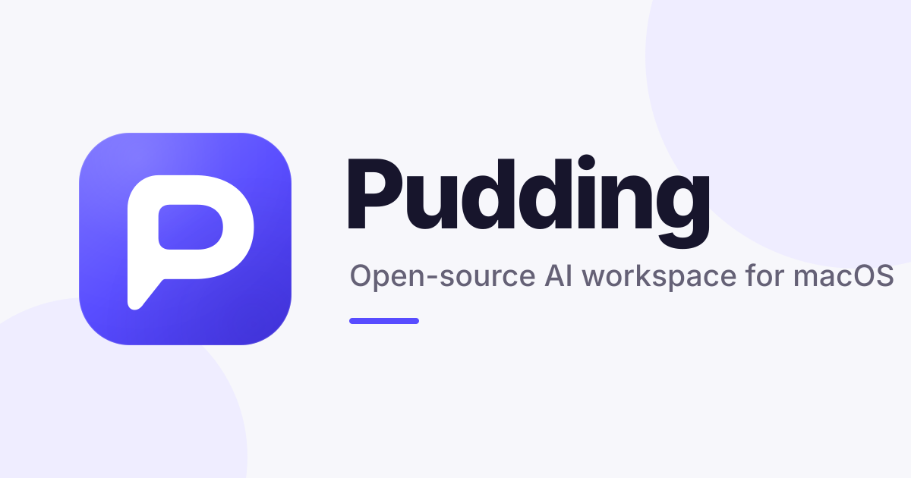

<p align="center">
  
</p>

<p align="center">
  <strong>An open-source AI workspace for macOS.</strong><br>
  Work across independent sessions with chat, projects, files, a browser, terminal, canvas, skills, and MCP apps in one desktop application.
</p>

<p align="center">
  <a href="https://x-t.top">Website</a> ·
  <a href="https://github.com/teatak/pudding/releases/latest">Download for macOS</a> ·
  <a href="docs/README.md">Documentation</a> ·
  <a href="https://github.com/teatak/pudding-core/issues">Issues</a>
</p>

> This is the source repository. Signed macOS downloads, update artifacts, and public release notes are published from
> [`teatak/pudding`](https://github.com/teatak/pudding).

## What Pudding does

- **Independent sessions** — keep each task's conversation, context, tools, and permissions separate.
- **Projects and files** — work with project folders and review file changes before accepting them.
- **Built-in browser** — research and use web applications without leaving the workspace.
- **Integrated terminal** — run development and automation tasks beside the conversation that requested them.
- **Canvas and artifacts** — keep useful documents, plans, tables, images, and other outputs visible and reusable.
- **Apps, skills, and MCP** — extend Pudding with built-in tools and connected services.
- **Bring your own model** — connect OpenAI, Anthropic, Google, OpenAI-compatible providers, or local models through Ollama.

Pudding is designed for work that spans more than a single chat: research a topic, inspect a project, run a command,
review the result, and keep the useful output in the same workspace.

## Download

Pudding currently targets macOS. Download the latest signed build from
[`teatak/pudding` releases](https://github.com/teatak/pudding/releases/latest).

This repository contains the source code. It does not publish application binaries.

## Development

Pudding currently targets macOS. Development requires Go 1.25.1, Node.js 24, npm, Xcode command-line tools,
and PortAudio. On macOS with Homebrew:

```bash
brew install portaudio
npm ci
npm --prefix web ci
make desktop-dev
```

Run the primary checks with:

```bash
go test ./...
npm test
npm --prefix web run build
```

See [CONTRIBUTING.md](CONTRIBUTING.md) before opening a pull request and [SECURITY.md](SECURITY.md) for private
vulnerability reporting.

## Documentation

- [Documentation index and project status](docs/README.md)
- [Architecture decisions](docs/technology-decisions.md)
- [Apps and connections](docs/apps.md)
- [Tool-usage reporting](docs/tool-usage-report.md)
- [Versioning, packaging, and releases](docs/releasing.md)

Chinese text segmentation is provided by the separately maintained MIT-licensed
[`teatak/seg`](https://github.com/teatak/seg) module.

## Contributing

Read [CONTRIBUTING.md](CONTRIBUTING.md) before opening a pull request. Report security vulnerabilities privately by
following [SECURITY.md](SECURITY.md).

## License

Pudding source code is licensed under the [GNU Affero General Public License v3.0](LICENSE).
The Pudding name, logos, icons, and other brand assets are not granted under that license; see
[TRADEMARKS.md](TRADEMARKS.md). Third-party components remain under their respective licenses.
